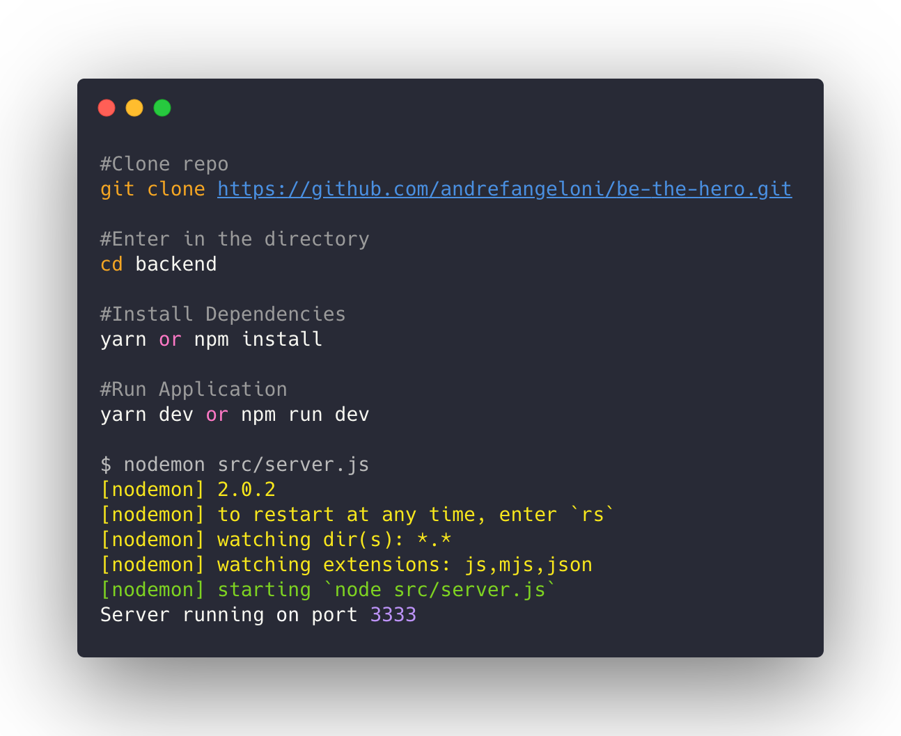
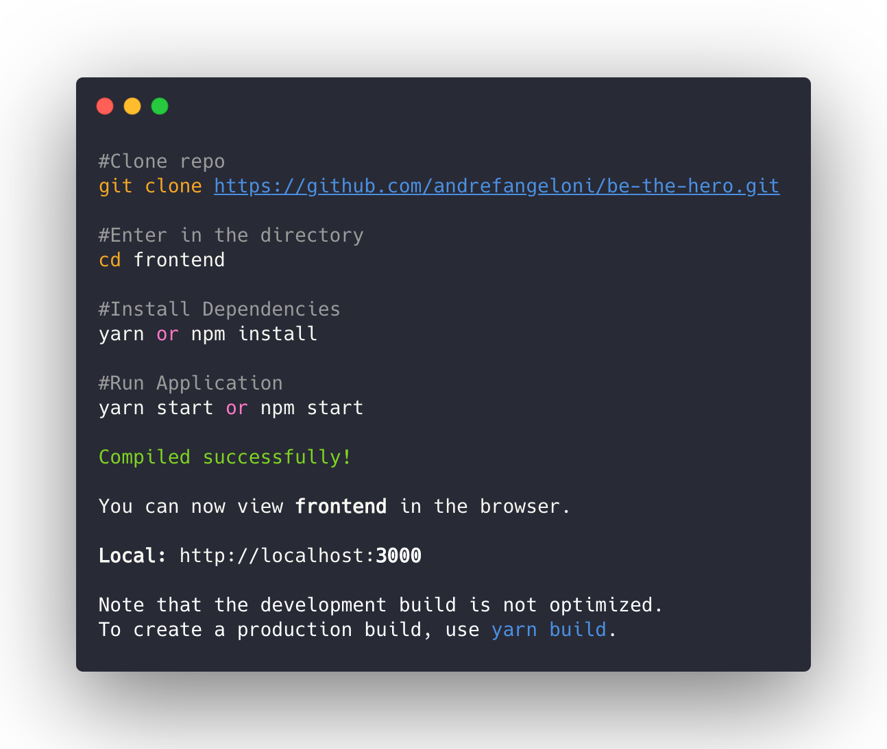
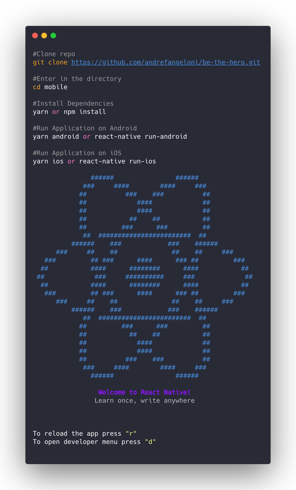

  

# About

The purpose of this application is for NGO ask some financial help to people of incidents cases that happened with animals on their cities.

Application developed together with [Rocketseat](https://rocketseat.com.br)

# :camera: Click here to see the project screenshots
 <a href="https://github.com/andrefangeloni/be-the-hero/tree/master/frontend">Web</a>  
 <a href="https://github.com/andrefangeloni/be-the-hero/tree/master/mobile">Mobile</a> 

# Installation 

## :electric_plug: Requeriments

- Node.js >= 10.14.2
- Yarn >= 1.12.3
- NPM >= 6.4.1

## Getting started - Backend

## :computer: Getting started the frontend 

## :iphone: Getting started the mobile 
:warning: Assuming that you've already the [Environment Setup](https://reactnative.dev/docs/environment-setup) for React Native CLI Quickstart

# :mortar_board: License

This project is licensed under the MIT License - see the [LICENSE](LICENSE.md) file for details.

# Author

+ :man_technologist: LinkedIn: [André Angeloni](https://www.linkedin.com/in/andre-angeloni)

